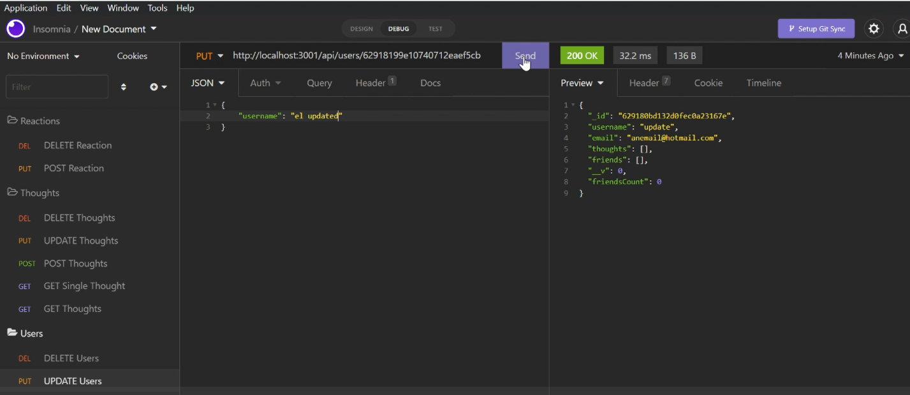

# API For Your Network
## Description
  
- Reason behind the project: This was built with the purpose to provide a client a back-end to a interactive social network for users.
- Purpose or Problem Solved: It allows users to communicate thoughts, and reactions, as well as add friends.
- Important information learned: Here I learned how to utilize NoSQL databases for a quicker less strict result
  
## Table of Contents (Optional)
  
- [Installation](#installation)
- [Usage](#usage)
- [Credits](#credits)
- [License](#license)
- [Tests](#tests)
- [Questions](#questions)
  
## Installation

Download zip from my github link below

## Usage
  
Test routes using Insomnia

Screenshot attatched
  

  
## Credits
  
Collaborators: No collaborators 
  
## License
  
Unlicensed

## Tests
  
N/A
  
## Questions
  
All questions and communications can be directed to:
Github: github.com/frivera14 
